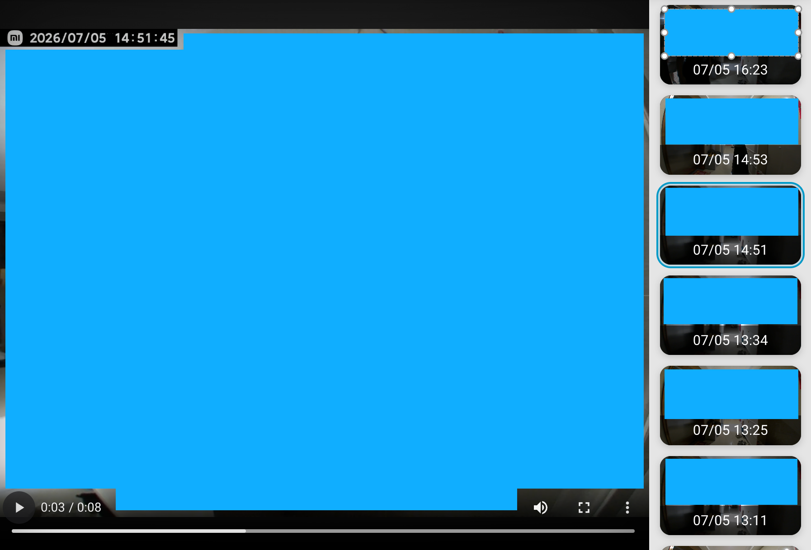

# Gallery Card 2026

[English](README.md) | [中文](README.zh-CN.md)

Home Assistant Lovelace custom card for browsing images and videos from media sources, file-list sensors, and camera entities.

This project is a fork adapted for a more gallery-like layout, date filtering, lazy thumbnails, loading states, and mobile-friendly navigation.

## Preview



## Current Features

- Large preview area with thumbnail list on the right, left, top, bottom, hidden, or responsive layout.
- Supports images, videos, Home Assistant camera entities, `media-source://` paths, and file-list sensor attributes.
- Loading and empty states for the preview and thumbnail list.
- Lazy thumbnail loading with media URLs resolved only when thumbnails enter the scroll viewport.
- Date filtering with optional folder/date parsing.
- Touch swipe, keyboard arrow navigation, and mobile-visible previous/next controls.
- Optional title and manual reload action in the compact list toolbar.
- Optional slideshow and video playback settings.
- Safe cleanup for keyboard listeners, lazy-load observer, slideshow timer, and temporary media URL cache.

## Installation

Build output is `gallery-card.js` in the project root. Put that file where Home Assistant can serve it, for example:

```text
/config/www/community/gallery-card/gallery-card.js
```

Then add the Lovelace resource:

```yaml
url: /local/community/gallery-card/gallery-card.js
type: module
```

Use the card as:

```yaml
type: custom:gallery-card
title: Door Lock
entities:
  - path: media-source://media_source/local
    recursive: true
menu_alignment: right
items_per_page: 12
maximum_files: 100
enable_date_search: true
folder_format: YYYYMMDD
search_date_folder_format: YYYYMMDD
date_search_adjacent_days: 1
file_name_format: YYYYMMDDHHmmss
caption_format: MM/DD HH:mm
show_reload: true
```

## Local Development

Install dependencies:

```bash
npm ci --cache /tmp/gallery-card-2026-npm-cache
```

Build once:

```bash
npm run build
```

Watch source changes:

```bash
npm run watch
```

During development, copy the generated root-level `gallery-card.js` to the Home Assistant resource path and hard-refresh the dashboard.

## Configuration

### Required Source

Use either `entity` or `entities`.

| Name | Type | Default | Description |
|------|------|---------|-------------|
| `entity` | string | none | Single source. Converted internally to `entities`. |
| `entities` | list | none | List of entity ids or media-source objects. |

Entity entries can be strings:

```yaml
entities:
  - sensor.front_door_files
```

Or media-source objects:

```yaml
entities:
  - path: media-source://media_source/local/camera
    recursive: true
    include_images: true
    include_video: true
```

Supported object fields:

| Name | Type | Default | Description |
|------|------|---------|-------------|
| `path` | string | required | Media source path. |
| `recursive` | boolean | `false` | Browse child directories. |
| `include_images` | boolean | `true` | Include image media classes. |
| `include_video` | boolean | `true` | Include video media classes. |
| `folder_format` | string | card value | Override card-level folder format. |
| `file_name_format` | string | card value | Override card-level filename date format. |
| `file_name_date_begins` | number/string | card value | Start position for parsing date from filename. |
| `caption_format` | string | card value | Override card-level caption format. |

### Layout

| Name | Type | Default | Description |
|------|------|---------|-------------|
| `title` | string | none | Compact title shown in the list toolbar. |
| `menu_alignment` | string | `responsive` | `responsive`, `right`, `left`, `bottom`, `top`, or `hidden`. |
| `items_per_page` | number | `10` | Initial thumbnail count and increment size for "more". |
| `show_reload` | boolean | `false` | Show a manual media reload button in the list toolbar. |

### Limits And Sorting

| Name | Type | Default | Description |
|------|------|---------|-------------|
| `maximum_files` | number | unlimited | `0` means unlimited. |
| `maximum_files_per_entity` | boolean | `true` | Apply `maximum_files` per entity instead of globally. |
| `reverse_sort` | boolean | `true` | Reverse filename/media-title order after sorting. |
| `random_sort` | boolean | `false` | Shuffle resources after loading. |
| `parsed_date_sort` | boolean | `false` | Sort by parsed date from `file_name_format`. |

### Date And Caption Parsing

Old strftime-like tokens such as `%Y`, `%m`, `%d`, `%H`, `%M`, `%S` are converted to Day.js-style tokens internally.

| Name | Type | Default | Description |
|------|------|---------|-------------|
| `enable_date_search` | boolean | `false` | Show the date picker and filter by selected date. |
| `search_date_folder_format` | string | `DD_MM_YYYY` | Folder name format used when recursively filtering date folders. |
| `date_search_adjacent_days` | number | `1` | Also inspect up to this many folder dates before and after the selected date, then filter exactly by the filename date. Requires `file_name_format`; range: `0`-`7`. |
| `folder_format` | string | none | Enables targeted recent-folder searching when used with `maximum_files` and reverse sort. |
| `file_name_format` | string | none | Date format used to parse filenames. |
| `file_name_date_begins` | number/string | none | 1-based filename position where date parsing starts. |
| `caption_format` | string | filename | Day.js format for captions. Use `AGO` for relative time. Use a single space to hide filename captions. |

### Video And Slideshow

| Name | Type | Default | Description |
|------|------|---------|-------------|
| `video_loop` | boolean | `false` | Loop the main video preview. |
| `video_autoplay` | boolean | `false` | Autoplay the main video preview. |
| `video_muted` | boolean | `false` | Mute videos after metadata loads. |
| `video_preload` | boolean | `true` | Preload video metadata in thumbnails. |
| `preview_video_at` | number | `0.1` | Timestamp used for video thumbnail preview metadata. |
| `show_duration` | boolean | `true` | Keep video duration handling enabled where duration markup exists. |
| `slideshow_timer` | number/string | none | Seconds between automatic preview changes. |
| `slideshow_video_end` | boolean | `false` | Advance slideshow when a video ends. |

### Performance

| Name | Type | Default | Description |
|------|------|---------|-------------|
| `browse_cache_seconds` | number | `20` | Cache media directory browse results briefly. Set to `0` to disable. |
| `media_cache_size` | number | `500` | Maximum number of resolved temporary media URLs kept in the LRU cache. |
| `resolve_concurrency` | number | `4` | Concurrent URL resolutions per visible batch. Values above `8` are capped. |

## Notes

- `media-source://` items need `resolve_media` URLs. The card resolves the main preview first, then resolves thumbnails only when they enter the scroll viewport or are selected.
- Recursive sources with `maximum_files` stop traversing once enough sorted media has been collected instead of expanding the complete directory tree.
- If a recorder stores after-midnight files in the previous day's folder, the default adjacent-folder search still assigns them to the date parsed from their filenames.
- The manual reload action clears both directory and temporary URL caches.
- Temporary media URLs are cached for less than the Home Assistant resolve expiration window.
- File-list sensors are expected to expose `fileList` or `file_list` attributes.
- The root `gallery-card.js` file is generated from `src/gallery-card.js`.

## Credits

Forked from [lukelalo/gallery-card](https://github.com/lukelalo/gallery-card), which is forked from [TarheelGrad1998/gallery-card](https://github.com/TarheelGrad1998/gallery-card). This repository keeps the original MIT license and adapts the card for this project's Home Assistant usage.
